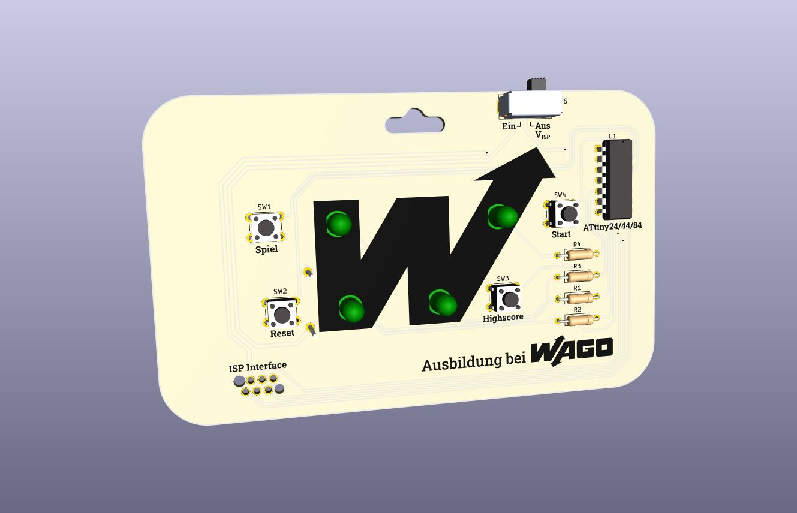

# Praktikum – Lichtfolge

Bau einer kleinen Platine als handheld Spielekonsole.

- **Dauer:** ~20 Min. (ohne Auf- und Abbbauzeit)

 

## Quick Links
- **Dokumentation:** [wago-enterprise-education.github.io/praktikum-lichtfolge/](https://wago-enterprise-education.github.io/praktikum-lichtfolge/)
- **Bestückungsplan:** [docs/Bestueckungsplan_praktikum-lichtfolge_v1.0.html](https://wago-enterprise-education.github.io/praktikum-lichtfolge/Bestueckungsplan_praktikum-lichtfolge_v1.0.html)
- **Schaltplan:** [pcb/schematics_praktikum-lichtfolge.pdf](pcb/schematics_praktikum-lichtfolge.pdf)
- **Materialliste (BOM):** [bom/ibom_praktikum-lichtfolge_v1.0.html](https://wago-enterprise-education.github.io/praktikum-lichtfolge/bom/ibom_praktikum-lichtfolge_v1.0.html)

## Ansprechpartner
- [Tobias Lauxtermann](mailto:tobias.lauxtermann@wago.com)
