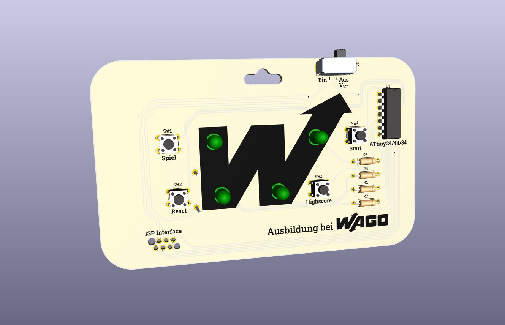
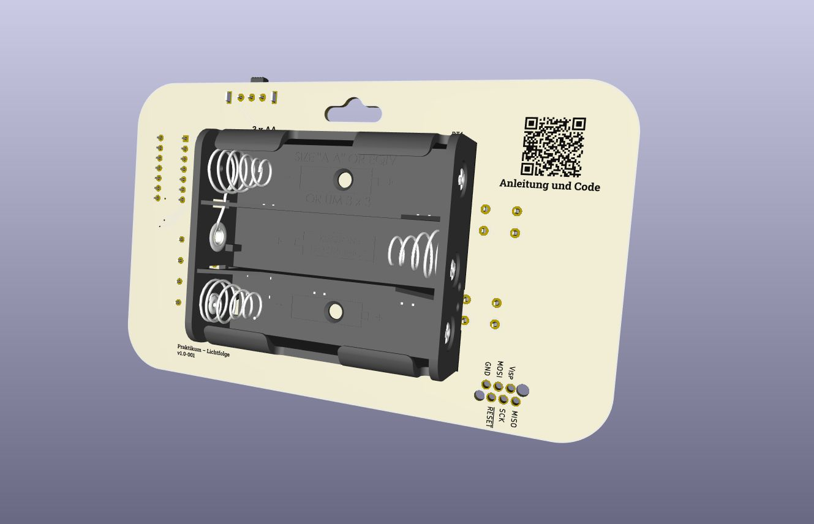
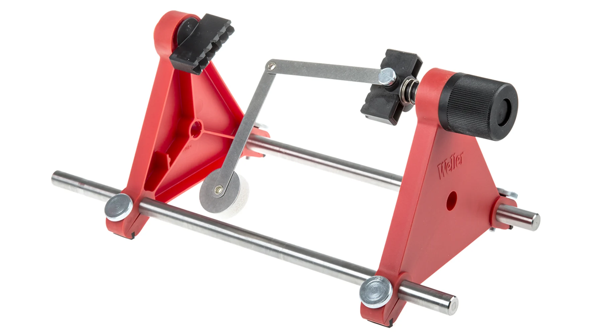
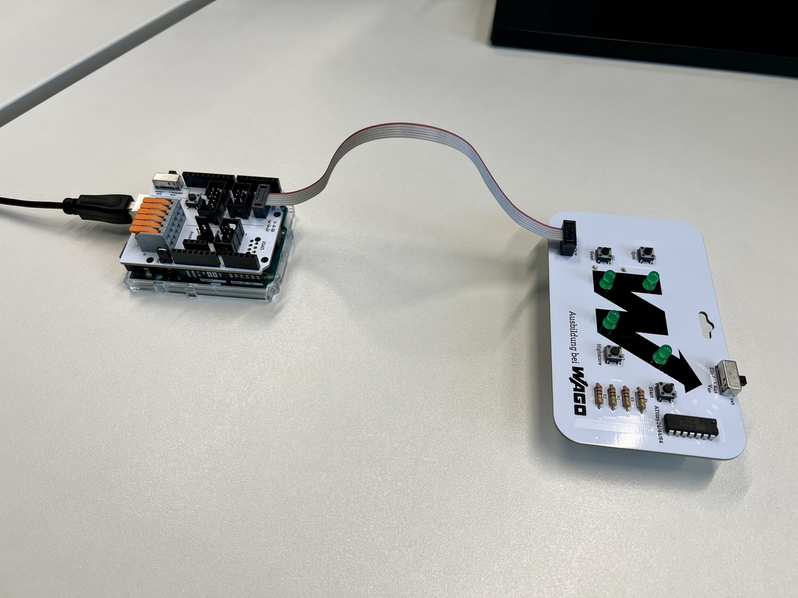
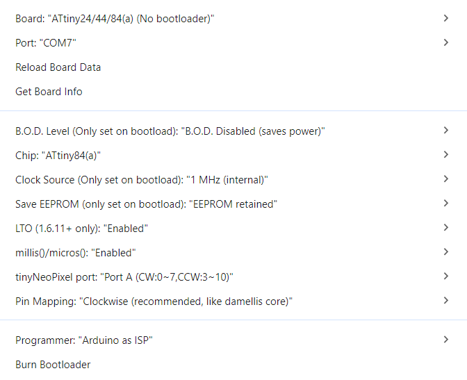

 ---
 layout: post
 title: "Praktikum – Lichtfolge"
 lang: de
 ---

# Praktikum – Lichtfolge

1. [Bauanleitung](#bauanleitung) 
2. [Upload des Programmcodes](#upload-des-programmcodes)
3. [Programming Guide](#programming-guide)

## Bauanleitung

{:.info}
Einen interaktiven Bestückungsplan mit Bauteilliste findest du hier: **[Bestückungsplan ➡️](Bestueckungsplan_praktikum-lichtfolge_v1.0.html)**

Beginne beim Bestücken und anschließenden Löten der Platine mit den **niedrigsten Bauteilen**. Sonst kann es eventuell schwierig werden diese später zu erreichen. Bei dieser Platine ist es wichtig den **Batteriehalter auf der Rückseite als letztes** einzubauen, da anschließend einige Lötstellen nicht mehr erreichbar sind. Dies ist auch das einzige Bauteil, das nicht auf der Vorderseite bestückt wird.



Gelötet wird bei THT-Bauteilen (Through Hole Technology, deutsch Durchsteckmontage) immer auf der Nicht-Bestückungsseite. Also muss die Platine nach dem Einsetzen einmal gedreht werden. Damit die Bauteile dabei nicht herausfallen, sollten die Komponenten provisorisch fixiert werden. Manche Platinenhalter haben dafür bereits eine Vorrichtung (vgl. Abb.). Eine einfache Alternative ist Malerkrepp (leicht lösbares Klebeband), das über die Bauteile geklebt wird. Dabei ist es sinnvoll, **nicht alle Bauteile auf einmal** zu bestücken und anschließend zu löten, sondern in Gruppen ähnlicher und benachbarter Komponenten zu arbeiten. Die Taster und der Schiebeschalter auf dieser Platine müssen zum Löten nicht fixiert werden.



Da wir bleifreies Lötzinn verwenden, sollte der Lötkolben etwas höher eingestellt werden. **330 bis 360°C** sind ein guter Richtwert. Für Lötstellen, die mit einer großen Kupferfläche verbunden sind, beispielsweise GND-Flächen, können auch 380°C sinnvoll sein. Mit steigender Temperatur sinkt jedoch die aktive Dauer des Flussmittels im Lötzinn deutlich, was wiederum das Löten erschwert. Mehr als 380°C sollten nicht eingestellt werden, da dies die Lebensdauer der Lötspitze stark verringert.

Achte beim Löten darauf zunächst **das Lötpad auf der Platine und das Beinchen des entsprechenden Bauteils gleichzeitig zu erhitzen** und erst nach einigen Sekunden Lötzinn hinzuzugeben. Geduldig sein sorgt hier für bessere Ergebnisse. Halte anschließend den Lötkolben noch kurz an die Lötstelle bis das Lötzinn schön geflossen und das gesamte Lötpad bedeckt ist. Sollte das hinzugegebene Lötzinn nicht ausreichen, kann hier auch noch etwas nachgeführt werden. 

Anschließend können mit einem Seitenschneider die überstehenden Drähte abgeknipst werden. Achte darauf dies nicht zu tief zu tun und **nur das Beinchen zu durchtrennen**, nicht die Lötstelle.

Bevor der Batteriehalter auf der Rückseite eingesetzt wird (dieser wird entsprechend auf der Vorderseite verlötet), klebe etwas **doppelseitiges Schaumstoffklebeband** darauf, um für zusätzliche mechanische Stabilität und Abstand zu den anderen Lötstellen zu sorgen.

## Upload des Programmcodes

{:.info}
**[Programmcode herunterladen ➡️](https://github.com/wago-enterprise-education/praktikum-lichtfolge/blob/main/code/praktikum-lichtfolge/praktikum-lichtfolge.ino)**

Die Platine verwendet für die Spiellogik einen Mikrocontroller aus der [ATtinyx4A ↗️](https://ww1.microchip.com/downloads/en/DeviceDoc/ATtiny24A-44A-84A-DataSheet-DS40002269A.pdf){:target="_blank" rel="noopener"} Reihe. Um genügend Speicherplatz für mehrere Spiele bereitzustellen, kommt der **ATtiny84A** zum Einsatz. Die Mikrocontrollerreihe verfügt über einen internen Oszillator für den Prozessortakt und kann über ein ISP-Interface programmiert werden. Der Eingangsspannungsbereich beträgt 1,8 bis 5,5 V.

Programmieren kann man den Mikrocontroller beispielsweise über die MPLAB® X IDE von Microchip, aber auch über Tools wie avrdude oder Arduino.

Bei unseren Praktikumsmodulen verwenden wir die [Arduino IDE ↗️](https://www.arduino.cc/en/software/){:target="_blank" rel="noopener"}. Dabei handelt es sich um eine open source Entwicklungsumgebung mit einer großen und aktiven online Community mit vielen Ressourcen zum Lernen. Über den darin integrierten Boards Manager kann der [ATTinyCore ↗️](https://github.com/SpenceKonde/ATTinyCore){:target="_blank" rel="noopener"} installiert werden, der es ermöglicht AVR-basierte Mikrocontroller wie den ATtiny84A zu programmieren.

Dafür wird ein zusätzliches Gerät, ein **ISP-Programmer**, benötigt. Es kann jedoch auch beispielsweise ein Arduino Uno hierfür verwendet werden. Hier findest du eine Anleitung dazu: [Programming ATtiny with Arduino code ↗️](https://wolles-elektronikkiste.de/en/programming-attiny-with-arduino-code){:target="_blank" rel="noopener"}. Die entsprechenden ISP-Verbindungen sind auf der Rückseite der Platine gekennzeichnet an die du übergangsweise Kabel anlöten kannst. 

Für eine schnelle und unkomplizierte Programmierung wurde im WAGO Ausbildungsbereich zusätzlich ein [ISP UPDI Programmer](https://wago-enterprise-education.github.io/isp-updi-programmer/) als Aufsatz für einen Arduino Uno entwickelt. Über lötfreie Steckverbinder kann hiermit der Mikrocontroller auf der Platine programmiert werden.



### Kurzanleitung
0. Falls nicht schon geschehen: AurduinoISP Sketch `File > Examples > 11.ArduinoISP > Arduino ISP` auf den Arduino Uno, Leonardo oder Mega laden. Beim WAGO ISP UPDI Programmer muss eventuell der linke Jumper entfernt werden. 
1. Arduino Projekt ([praktikum-lichtfolge](https://github.com/wago-enterprise-education/praktikum-lichtfolge/blob/main/code/praktikum-lichtfolge/praktikum-lichtfolge.ino)) öffnen
2. Mikrocontroller auswählen `Tools > Board: … > ATTinyCore > ATtiny24/44/84(a) (No bootloader)`
3. Standardeinstellungen können bestehen bleiben (vgl. Abb.)
4. `Tools > Programmer > Arduino as ISP` auswählen
5. `Tools > Port` und den COM-Port auswählen mit dem der Arduino verbunden ist
6. `Tools > Burn Bootloader` ausführen (muss bei Änderung der Clock Source erneut durchgeführt werden)
7. Upload (Pfeil oben links)



## Spielanleitung
Das UI (User Interface, deutsch Benutzeroberfläche) der Platine besteht aus 4 LEDs und 4 Tastern über die das Menü und die Spiele umgesetzt wurden. Im Folgenden wird kurz auf die verschiedenen Funktionen eingegangen.

### Spiel auswählen
Über **Taster 1 („Spiel“)** kann ein Spiel ausgewählt werden. Bei [Spiel 1](#spiel-1--lichtfolge) muss sich eine immer länger werdende Lichtfolge gemerkt werden, [Spiel 2](#spiel-2--reaktionstest) ist ein Reaktionsspiel, bei dem man möglichst schnell die LEDs „wegklicken“ muss, bei [Spiel 3](#spiel-3--würfeln) handelt es sich um einen digitalen Würfel und [Spiel Nummer 4](#programmcode-für-spiel-4) ist frei. Hier kannst du mithilfe des [Programming Guides](#programming-guide) dein eigenes Spiel entwickeln. Selbstverständlich steht es dir aber frei alle Spiele anzupassen oder ganz auszutauschen.

### Spiel starten
Über **Taster 4 („Start“)** kann das aktuell ausgewählte Spiel gestartet werden.

### Highscore anzeigen
**Taster 3** zeigt den aktuellen Highscore des Spiels an. Jede LED steht dabei für die Ziffer einer vierstelligen Zahl. Blinkt beispielsweise LED 3 1-Mal und danach LED 4 6-Mal, beträgt der Highscore für dieses Spiel 16.

### Highscore zurücksetzen
Um den Highscore eines Spiels zurückzusetzen, halte **Taster 2 („Reset“)** mindestens 5 Sekunden gedrückt.

### Spiele

In den folgenden Unterkapiteln werden die verfügbaren Spiele kurz erläutert.

|#| Spiel | Beschreibung |
|-|-------|--------------|
|1|Lichtfolge |Nach einer kurzen Animation, um den Start des Spiels zu signalisieren, leuchtet eine zufällige LED auf. Merke dir diese und drücke den zugehörigen Taster. Anschließend leuchtet die gleiche LED erneut auf, gefolgt von einer weiteren zufälligen LED (es kann auch die gleiche noch mal sein). Daraufhin drückst du wieder nacheinander die entsprechenden Taster. Die Folge wird so immer länger, bis du dir die Reihenfolge nicht mehr merken kannst und einen Fehler machst. Dann blinken alle LEDs kurz viermal auf und dir wird deine erreichte Punktzahl angezeigt (siehe Unterkapitel [Highscore anzeigen](#highscore-anzeigen)). Die Punktzahl entspricht hierbei der Länge der Lichtfolge. Wieviel kannst du dir merken?|
|2|Reaktionstest |Zu Beginn des Spiels leuchtet eine zufällige LED auf. Klicke schnellstmöglich auf den entsprechenden Taster, um sie auszuschalten. Anschließend leuchtet eine beliebige andere LED auf. Du hast 30 Sekunden Zeit, um so möglichst viele LED „wegzuklicken“. Jede LED gibt hierbei einen Punkt. Drückst du jedoch versehentlich auf einen falschen Taster, wird dir ein Punkt abgezogen. Das Minimum sind jedoch 0 Punkte. Wie gut sind deine Reaktionen?|
|3|Würfeln |Nach einer kurzen Zufallsanimation leuchten alle vier LEDs ein paar Mal auf. Dies entspricht der gewürfelten Zahl zwischen 1 und 6. Im Code kannst du den Zahlenbereich aber auch anpassen oder die Art der Darstellung ändern, sodass die Zahlen wie bei den Highscores angezeigt werden. So könnten auch zufällige Zahlen von 0 bis 9999 angezeigt werden.|
|4|Frei |Hier kannst du dein eigenes Spiel programmieren. Informationen dazu findest du im [Programming Guide](#programming-guide).|

## Programming Guide
In diesem Kapitel gibt es eine kurze Einführung dazu, wie du **selbst Spiele für die Platine programmieren** kannst. Grundlagen für das Programmieren in C++ (Arduino) werden dabei vorausgesetzt. Bei YouTube gibt es ansonsten viele einsteigerfreundliche Tutorials dazu, suche einfach nach *Arduino Tutorial* und schon nach kurzer Zeit solltest du in der Lage sein die LEDs nach deinen Vorgaben anzusteuern.

### Programmcode für Spiel 4
In der Funktion `playGame4()` kannst du deinen eigenen Code schreiben. Sie wird ausgeführt, wenn LED 4 leuchtet und Taster 4 („Start“) gedrückt wird. Aktuell wird hier nur die Funktion `errorAnimation()` aufgerufen, die kurz alle LEDs viermal aufleuchten lässt. Entferne diese Funktion testweise und ersetzte sie durch `startupAnimation()`. Anschließend erscheint beim Starten des Spiels die Animation, die auch beim Einschalten der Platine angezeigt wird.

### LEDs ansteuern
Die LEDs können über die Funktion `digitalWrite()` ein- oder ausgeschaltet werden. Die entsprechenden Pins sind in dem Array `leds` hinterlegt.

Um beispielsweise LED 1 leuchten zu lassen, schreibe: `digitalWrite(leds[0], HIGH)`.

{:.info}
Den Schaltplan der Platine, um zu sehen welche Pins des Mikrocontrollers womit verbunden sind, findest du hier: **[Schaltplan Praktikum – Lichtfolge ➡️](https://github.com/wago-enterprise-education/praktikum-lichtfolge/blob/main/pcb/schematics_praktikum-lichtfolge.pdf)**


### Taster abfragen
Zum Entprellen der Taster wird die Bibliothek [Bounce2 ↗️](https://github.com/thomasfredericks/Bounce2){:target="_blank" rel="noopener"} verwendet. Das **Entprellen von Tastern und Schaltern** ist notwendig, da bei deren Betätigung kleine Vibrationen entstehen, die dafür sorgen, dass kurzzeitig zwischen geschlossenem und geöffnetem Zustand gewechselt wird. Erst nach einigen Millisekunden stabilisiert sich der Zustand. Beim schnellen Abfragen der Taster mit einem Mikrocontroller, kann es dadurch zu **ungewollten Zustandsänderungen** kommen, die mithilfe der Bibliothek herausgefiltert werden.

Die Instanzen für die jeweiligen Taster sind in dem Array `buttons` abgelegt. Um beispielsweise den Zustand von Taster 1 zu aktualisieren, muss regelmäßig die Funktion `buttons[0].update()` aufgerufen werden. Dies geschieht nicht automatisch im Hintergrund. Zwischen zwei Abfragen des Zustands eines Tasters, muss also mindestens einmal die Update-Funktion aufgerufen werden, um ein anderes Ergebnis erhalten zu können. Zum Aktualisieren von allen vier Tastern auf einmal, kann die Funktion `updateButtons()` genutzt werden.

Die Bounce2 Bibliothek stellt einige Funktionen bereit, die das Arbeiten mit den Tastern vereinfacht. Hier eine Liste der gängigsten Methoden:

| Funktion | Beschreibung |
|----------|--------------|
|`pressed()`|Gibt „true“ zurück, wenn der Taster seit dem letzten Update gedrückt wurde, sich also der Zustand von „nicht-gedrückt“ zu „gedrückt“ geändert hat|
|`isPressed()`|Gibt „true“ zurück, wenn der Taster seit dem letzten Update gedrückt wurde, sich also der Zustand von „nicht-gedrückt“ zu „gedrückt“ geändert hat|
|`released()`|Gibt „true“ zurück, wenn der Taster aktuell gedrückt ist|
|`currentDuration()`|Gibt die Zeit zurück, wie lange der aktuelle Zustand herrscht|
|`read()`|Gibt den aktuellen Zustand (HIGH, LOW) des Tasters zurück. LOW = gedrückt, HIGH = nicht gedrückt.|

Die komplette Dokumentation findest du [hier ↗️](https://github.com/thomasfredericks/Bounce2){:target="_blank" rel="noopener"}.

### Weitere nützliche Funktionen und Variablen

| Funktion | Beschreibung |
|----------|--------------|
|`startupAnimation()`|Zeigt die Start-Animation an|
|`errorAnimation()`|Zeigt die Error-Animation an|
|`clearLEDs()`|Setzt alle LEDs auf LOW|
|`random(long n)`|Gibt eine pseudo zufällige natürliche Zahl von 0 bis n-1 zurück|
|`displayScore(uint16_t score)`|Zeigt den „score“ mithilfe der LEDs an|
|`enum Buttons {GAME, RESET, HIGHSCORE, START}`|Bietet die Möglichkeit die Indizes der Taster über den Namen ihrer Funktion im Menü zu referenzieren (`GAME = 0`, `RESET = 1`, …)|
|`enum Game {SIMON_SAYS, WHACK_A_MOLE, ROLL_DICE, GAME4}`|Bietet die Möglichkeit die Indizes der Spiele über ihre Namen zu referenzieren (`SIMON_SAYS = 0`, …) |
|`displayHighscore(Game game)`|Zeige den Highscore des entsprechenden Spiels an|
|`updateHighscore(Game game, uint16_t score)`|Aktualisiert den Highscore, falls der „score“ größer ist als der bisherige Highscore|

### Beispielcode
```C++
void playGame4() {
  startupAnimation();
  updateButtons();
  delay(50);

  while(!buttons[RESET].pressed()) { // Das Ausrufezeichen negiert den darauffolgenden Ausdruck
    updateButtons();
    
    if(buttons[0].isPressed()) digitalWrite(leds[0], HIGH);
    else digitalWrite(leds[0], LOW);

    if(buttons[2].isPressed()) digitalWrite(leds[2], HIGH);
    else digitalWrite(leds[2], LOW);

    if(buttons[3].isPressed()) digitalWrite(leds[3], HIGH);
    else digitalWrite(leds[3], LOW);
  }
  errorAnimation();
  delay(250);
  startupAnimation();
}

```

Analysiere den Code und versuche herauszufinden, was die Funktion macht. **Lade anschließend das angepasste Projekt hoch** und überprüfe deine Ergebnisse.
